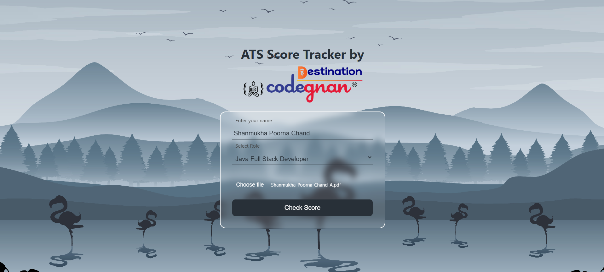
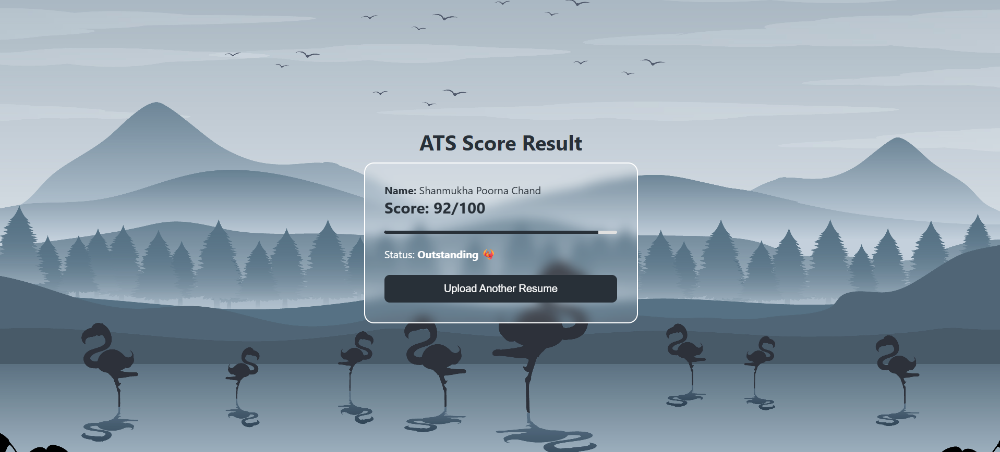

# ATS Resume Score Tracker 📝

A simple Spring Boot web application that allows users to upload their resumes and receive an **ATS (Applicant Tracking System)** score based on predefined criteria. The application provides a visual representation of the score using an animated counter, progress bar, and status feedback.

## 🚀 Features

- Upload resume files (`.pdf`, `.docx`, etc.)
- Extract and parse content (mocked or pre-defined for now)
- Score resumes based on basic ATS compatibility checks
- Animated score display with:
  - Incrementing number animation
  - Progress bar reflecting score percentage
  - Status text like `Very Bad`, `Needs Improvement`, `Fair`, `Good`, `Excellent`
- Reset and upload a new file

## 🛠️ Technologies Used

- **Java 17**
- **Spring Boot**
- **Thymeleaf** (Template engine)
- **HTML, CSS, JavaScript**
- **Maven** (Project management)
- **Apache Tika** (Extracts Text from the documents like PDF, DOCX, etc.)

## 📁 Project Structure

```
src/
├── main/
│   ├── java/
│   │   └── com/
│   │       └── ats/
│   │           ├── controller/
│   │           │   └── MainController.java
│   │           ├── model/
│   │           │   └── ResumeRequest.java
│   │           ├── service/
│   │           │   └── ResumeScoreService.java
│   │           └── AtsScoreCheckerApplication.java
│   └── resources/
│       ├── static/
│       │   ├── css/
│       │   │   └── style.css
│       │   └── js/
│       │       └── script.js
│       ├── templates/
│       │   ├── index.html
│       │   └── result.html
│       └── application.properties
├── screenshots/
│   ├── upload.png
│   └── result.png
├── README.md
└── test/
    └── java/
        └── com/
            └── ats/
                └── AtsScoreCheckerApplicationTests.java

```

## 📸 Screenshots

| Upload Resume Page | Score Result Page |
|--------------------|-------------------|
| | |

## 📦 How to Run the Project

1. Clone the repository:
   ```bash
   git clone https://github.com/your-username/ats-score-tracker.git
   cd ats-score-tracker
   ```

2. Build and run the application:
   ```bash
   mvn spring-boot:run
   ```

3. Open your browser and visit:
   ```
   http://localhost:8080
   ```

## ✅ Future Enhancements

- Integrate a real resume parsing engine (e.g., Apache Tika)
- Add keyword scanning (skills, experience, etc.)
- Save results to a database
- Generate downloadable PDF reports

## 🙋‍♂️ Author

**Shanmukha Poorna Chand**  
Java Full-Stack Developer | Passionate about Web Development and Clean UI Design  
📧 shanmukhapoornachand14316@gmail.com  
🔗 [LinkedIn Profile](www.linkedin.com/in/shanmukha-poorna-chand-adapaka)


> *Built with ❤️ using Java and Spring Boot.*

